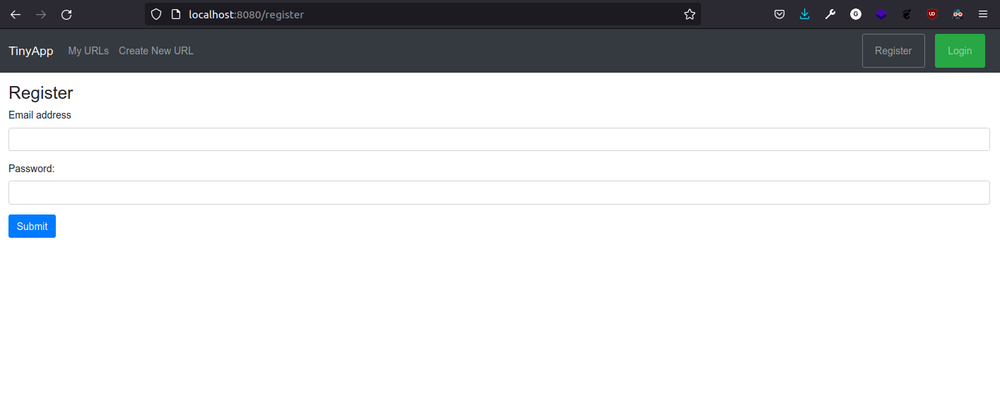

# TinyApp Project

TinyApp is a full stack web application built with Node and Express that allows users to shorten long URLs (à la bit.ly).

## Final Product

## Dependencies

- Node.js
- Express
- EJS
- bcrypt
- body-parser
- cookie-session
- _valid-url_
  > _Note:_ Only valid urls (https:// or http://) will be accepted.

## Getting Started

- Install all dependencies (using the `npm install` command).
- Run the development web server using the `node express_server.js` command.
